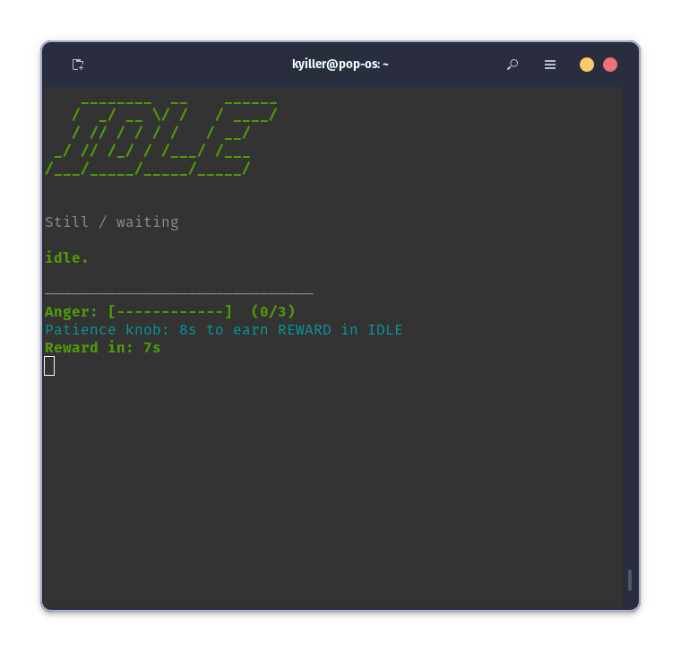
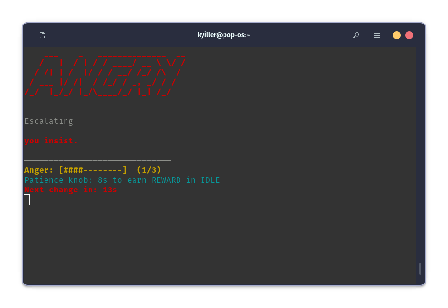
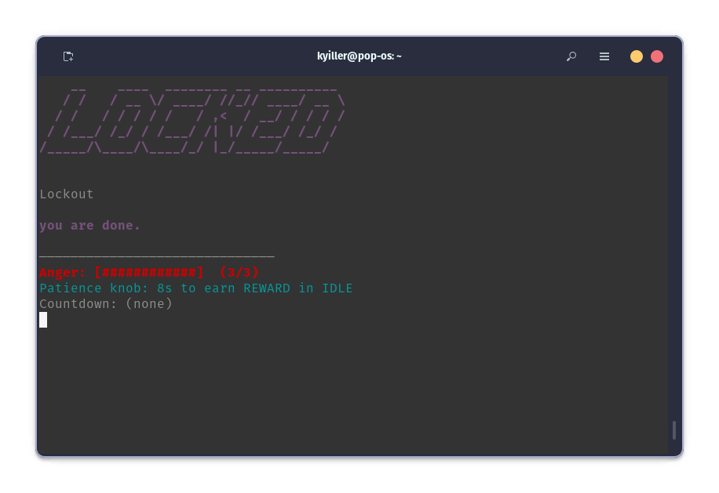

# Sentinel

An interactive embedded system with escalating behavior and a live PC HUD.

Sentinel is a physical device built on Arduino that reacts to disturbance using a finite state machine.
It rewards patience, escalates on repeated violations, and exposes live telemetry to a Python-based heads-up display over serial.

You can use it to play a game, try to hold the sentinel as still as you can, and if you can stay still for a period of time, you will get a reward. If you tilt it you will disturb it, tilt it enough times and you will have to manually unlock the device. By using the potentiometer you can adjust the patience of the sentinel, changing the difficulty of the game.

## How it works

Sentinel models interaction using discrete states:

- **IDLE** – calm, watching
- **ALERT** – warning after first disturbance
- **ANGRY** – blinking red + rapid audio feedback
- **COOLDOWN** – de-escalation period
- **REWARD** – positive feedback after sustained calm
- **LOCKED** – hard lockout requiring deliberate reset

State transitions are time-based and non-blocking.

Here is a demo of the physical machine:
 <iframe width="100%" height="400"
src="https://www.youtube.com/watch?v=V1LlBfyXuvo"
frameborder="0" allowfullscreen></iframe>

## HUD States:

**Idle**

**Alert**

**Angry**

**Reward**

**Locked**

## Engineering highlights

- Finite State Machine (FSM) architecture
- Edge-triggered tilt detection with re-arming to handle sensor chatter
- State-dependent sensitivity 
- Non-blocking timing with `millis()`
- Dual-format serial telemetry:
  - `[STATE] message` (human readable)
  - `@STAT ...` (machine readable for UI)

## Hardware

- Arduino Uno
- Tilt switch
- Button
- Piezo buzzer
- LEDs
- Resistors
- Trimmer potentiometer
- Breadboard
  

## Software

- Arduino C++ (embedded logic)
- Python (serial HUD)
- Live terminal UI with large colored state text

## Repository
https://github.com/kyirafisher/sentinel

